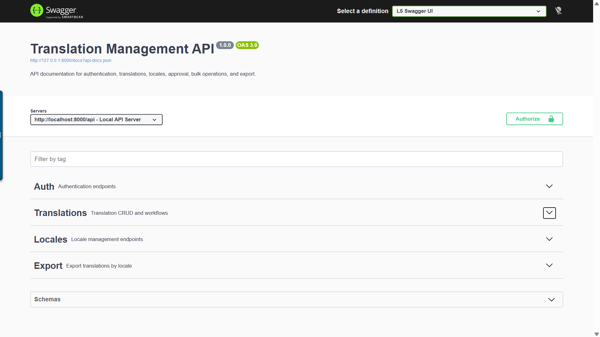

# 📘 Translation Management Service

A scalable Laravel-based API for managing translations with support for bulk operations, tagging, search, and export.

---

## 📑 Table of Contents

- [Overview](#overview)
- [Features](#features)
- [Tech Stack](#tech-stack)
- [Project Structure](#project-structure)
- [Setup Instructions](#setup-instructions)
- [Authentication](#authentication)
- [API Overview](#api-overview)
- [Design Decisions](#design-decisions)
- [Testing](#testing)
- [Future Improvements](#future-improvements)

---

## 📖 Overview

This service provides a robust backend for managing multilingual translations in a scalable and structured way. It supports efficient querying, bulk operations, and structured export formats for frontend consumption.


### 📸 API Documentation Preview




---

## 🚀 Features

- Secure authentication using Laravel Sanctum
- Locale management
- Translation CRUD operations
- Bulk translation creation (up to 1000 records)
- Advanced search (key, content, tag)
- Translation approval workflow
- Nested JSON export
- Pagination support
- OpenAPI (Swagger) documentation
- Unit and feature test coverage

---

## 🏗️ Tech Stack

- PHP 8.2
- Laravel
- MySQL
- Docker (PHP-FPM + Nginx)
- Laravel Sanctum
- OpenAPI (Swagger)
- PHPUnit

---

## 📂 Project Structure

```
app/
 ├── Http/
 ├── Models/
 ├── Services/

database/
 ├── migrations/
 ├── factories/
 ├── seeders/

docker/
 └── nginx/

tests/
 ├── Feature/
 ├── Unit/
```

---

## ⚙️ Setup Instructions

### 1. Clone Repository

```
git clone <your-repo-url>
cd translation-service
```

### 2. Environment Setup

```
cp .env.example .env
```

Update DB config:

```
DB_CONNECTION=mysql
DB_HOST=db
DB_PORT=3306
DB_DATABASE=translation_service
DB_USERNAME=laravel
DB_PASSWORD=secret
```

### 3. Run with Docker

```
docker-compose up -d --build
```

### 4. Initialize Application

```
docker exec -it translation_app bash

php artisan key:generate
php artisan migrate --seed
```

### 5. Access API

```
http://localhost:8000/api
```

---

## 🔐 Authentication

### Login

```
POST /api/login
```

```
{
  "email": "admin@example.com",
  "password": "password"
}
```

Use returned token:

```
Authorization: Bearer {token}
```

---

## 📌 API Overview

### Translations
- GET /translations
- POST /translations
- PATCH /translations/{id}
- DELETE /translations/{id}
- PATCH /translations/{id}/approve

### Search
```
POST /translations/search
```

```
{
  "search_type": "content",
  "query": "Login",
  "locale": "en"
}
```

### Bulk Create
```
POST /translations/bulk
```

### Export
```
GET /export/{locale}
```

---

## 🧠 Design Decisions

### Service Layer Pattern
Business logic is centralized in `TranslationService`, ensuring separation of concerns and testability.

### Database Design
Normalized schema:
- translation_keys
- translations
- locales
- tags

Ensures scalability and avoids duplication.

### Export Strategy
Uses `Arr::set()` to convert flat keys into nested JSON structure for frontend consumption.

### Validation
Handled via FormRequest classes to ensure clean controllers and consistent input validation.

### Performance
- Indexed database columns
- Pagination for large datasets
- Performance tests included

---

## 🧪 Testing

Run all tests:

```
php artisan test
```

Includes:
- Feature tests (API)
- Unit tests (service layer)
- Performance benchmarks

---

## 🚧 Future Improvements

- Redis caching
- Queue-based bulk processing
- Rate limiting
- API versioning
- Role-based access control

---

## 👨‍💻 Author

Production-style backend system for scalable translation management.
